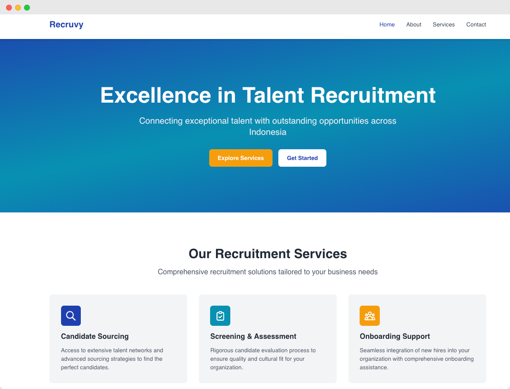
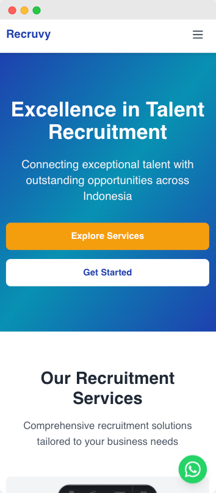

# PT. Recruvy International Group
## Corporate Website

> Professional company profile website for PT. Recruvy International Group, a leading talent recruitment company serving multiple industries across Indonesia.

## 🌐 Live Website
**[View Live Site →](https://recruvy-website.pages.dev)**

---

## 📖 About The Project

PT. Recruvy International Group required a modern, professional online presence to showcase their recruitment services and facilitate client engagement. This corporate website serves as their digital storefront, presenting their company values, service offerings, and providing seamless communication channels for potential clients.

### Project Context
- **Client**: PT. Recruvy International Group
- **Type**: Corporate Profile Website
- **Industry**: Talent Recruitment
- **Scope**: Static company profile with contact integration

---

## ✨ Key Features

### 🏠 Home Page
Professional landing page featuring company overview, value proposition, and quick access to services. Designed to create strong first impressions and guide visitors to relevant information.

### 👥 About Company
Comprehensive introduction to PT. Recruvy International Group, showcasing company mission, vision, and core values that drive their recruitment excellence.

### 💼 Services Overview
Detailed presentation of recruitment services, including:
- **Recruitment Process**: Step-by-step workflow from consultation to onboarding support
- **Industry Expertise**: IT, Finance, Healthcare, Manufacturing, Retail, and Professional Services

### 📞 Contact Integration
Multiple touchpoints for client communication:
- Professional contact form powered by Formspree
- Floating WhatsApp button for instant messaging
- Complete company contact information

---

## 🎨 Design Highlights

- **Mobile-First Responsive**: Seamless experience across all devices (desktop, tablet, mobile)
- **Professional Aesthetics**: Clean, modern design reflecting corporate professionalism
- **User-Friendly Navigation**: Intuitive structure for easy information access
- **Performance Optimized**: Fast loading times for optimal user experience
- **SEO Ready**: Properly structured for search engine visibility

---

## 🚀 Technical Overview

Built as a **static website** for optimal performance and reliability:
- **Framework**: Astro (Static Site Generator)
- **Styling**: Tailwind CSS
- **Deployment**: Cloudflare Pages (Global CDN)
- **Performance**: Lighthouse Score 100/100

### Why Static?
Static sites offer unmatched speed, security, and cost-effectiveness—perfect for company profiles that prioritize performance and reliability without requiring dynamic functionality.

---

## 📱 Website Structure

| Page | Purpose |
|------|---------|
| **Home** | Landing page with company overview and service highlights |
| **About** | Company background, mission, vision, and values |
| **Services** | Detailed recruitment process and industry specializations |
| **Contact** | Multi-channel contact options and inquiry form |

---

## 🎯 Business Goals Achieved

✅ **Professional Online Presence**: Modern website reflecting company credibility and expertise  
✅ **24/7 Accessibility**: Always-available information for potential clients and candidates  
✅ **Lead Generation**: Multiple contact channels facilitating client inquiries  
✅ **Service Showcase**: Clear presentation of recruitment capabilities and process  
✅ **Mobile Accessibility**: Reach clients on any device, anywhere  

---

## 🔮 Future Enhancements

Phase 2 development is planned to transform this company profile into a full-featured job portal:
- Job board with active listings and advanced filtering
- Online application system with CV upload
- Candidate profile management and tracking
- Admin dashboard for HR team operations
- Application tracking and status management
- Email notification system

[View detailed Phase 2 roadmap →](./Docs/PHASE2_ROADMAP.md)

---

## 📊 Project Impact

This website serves as the foundation for PT. Recruvy International Group's digital transformation:
- **Enhanced Visibility**: Professional online presence in competitive recruitment market
- **Client Convenience**: Easy access to company information and services 24/7
- **Scalability**: Solid foundation ready for future feature expansion
- **Cost Efficiency**: Low-maintenance static website with high performance and minimal hosting costs

---

## 📸 Screenshots

### Desktop View
*Clean, professional layout optimized for desktop browsing experience*

### Mobile View
*Fully responsive design ensuring great user experience on smartphones and tablets*

  

---

## 🛠️ Technology Stack

**Frontend Framework**  
Astro - Modern static site generator prioritizing performance and developer experience

**Styling**  
Tailwind CSS - Utility-first CSS framework for rapid UI development

**Deployment**  
Cloudflare Pages - Global CDN ensuring fast content delivery worldwide

**Integrations**  
- Formspree for contact form handling
- WhatsApp Business API for instant messaging

---

## 👨‍💻 Developer

**Adam Almahdi**  
Full-Stack Web Developer

- 📧 Email: [adam.almahdi@hotmail.com](mailto:adam.almahdi@hotmail.com)
- 💼 LinkedIn: [linkedin.com/in/adamalmahdi](https://linkedin.com/in/adamalmahdi)
- 🌐 Portfolio: [adamalmahdi.com](https://adamalmahdi.com)

---

## 📄 Project Details

- **Completion Date**: October 2025
- **Project Phase**: Phase 1 (Company Profile)
- **Project Duration**: 2 weeks
- **Repository**: Public (Portfolio Showcase)

---

## 🤝 Acknowledgments

Special thanks to PT. Recruvy International Group for the opportunity to build their digital presence and contribute to their business growth through modern web technology.

---

## 📚 Documentation

Additional documentation is available in the `/Docs` folder:
- Quick Start Guide
- Phase 2 Development Roadmap
- Deployment Instructions

---

**Built with modern web technologies for maximum performance**

[Astro](https://astro.build) • [Tailwind CSS](https://tailwindcss.com) • [Cloudflare Pages](https://pages.cloudflare.com)

---

⭐ **Star this repository if you find it interesting!**

*This project demonstrates professional corporate website development with focus on performance, user experience, and scalability.*

